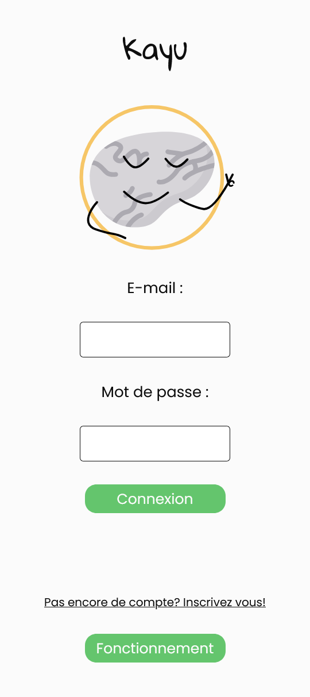
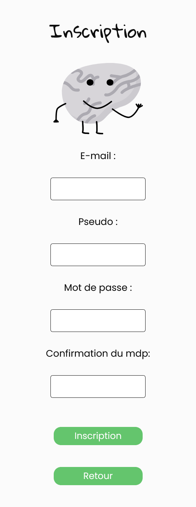

# Kayu

Kayu est une application réalisée au sein de la formation de chez M2I villeneuve-d'ascq.

Elle reprend les fondamentaux des différents cours suivis pendant la formation:

- Réalisation de la partie front-end d'une application web
- Réalisation de la partie back-end d'un application web

## Frameworks

Pour réaliser l'application j'ai utilisé 2 frameworks : 

- **Vue.js** grâce auquel j'ai pu facilement VueRouter pour pouvoir faire une application SPA (single page application).

- **Laravel** et son système d'authentification intégré (Breeze, Sanctum).

## Qu'est ce que Kayu?

Kayu est une application **Mobile pour le moment**. Elle reprend la base de l'application Yuka, qui est de pouvoir scanner des articles grâce à leur code barres et ensuite, de nous afficher les différentes caractéristiques de ce produit comme par exemple: l'emprunte carbonne ou encore son nutri score.

## Développement

❗**Kayu est encore en cours de développement.**❗

On peut actuellement s'y inscrire, se connecter, supprimer son compte, voir si nous sommes connecter ou non mais aussi scanner des articles.

## Comment utiliser l'application.

- Veuillez bien vérifier tout d'abord que Node.js, php et Composer sont biens installés sur votre ordinateur.
- Créez une base de données via Laragon par exemple nommée kayu.
- Clonez le repo.
- Créez et configurez votre fichier .``env`` dans le dossier Laravel (copiez-collez le ``.env.example`` renommez le en ``.env`` et configurez le).
- Lancez votre BDD et lancez le projet:
1. Utilisez la commande ``npm -i`` dans le répertoire **'Vue'** pour les dépendances de Vue.js
2. Utilisez la commande ``composer i`` dans le répretoire **laravel** pour les dépendances de Laravel
3. Utilisez la commande ``npm run dev`` pour ouvrir l'application Kayu.
4. Utilisez la commande ``php artisan serve`` pour lancer le projet Laravel.
- L'application est prête à être utilisée.

# Illustrations

 
 
 
 S

## Un problème?

Kayu à été développée il y a un certain temps. Elle pourrais malheureusement ne plus fonctionner...

Si tel est le cas n'hésitez pas à me contacter.

Amusez vous bien 😊